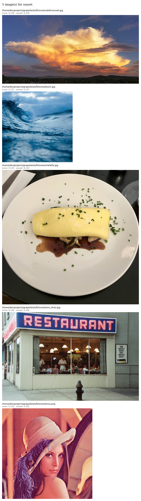

# grape

Find images matching keywords using [CLIP](https://arxiv.org/abs/2103.00020)
(Radford et al., 2021). Like grep, but for images.

```
$ grape -R -s -k sunset ~/Pictures
0.327  ~/Pictures/vacation/beach_golden_hour.jpg
0.285  ~/Pictures/vacation/pier_evening.jpg
0.241  ~/Pictures/hiking/mountain_view.jpg
```



## Install

```
pip install .
```

Python 3.10+. Model weights (~1.7 GB for the default) download on first run.

For a headless install without the `--view` GUI deps:

```
pip install . --no-deps
pip install open-clip-torch torch dask Pillow platformdirs tqdm transformers sentencepiece
```

## Usage

Paths can be files, directories (with `-R`), or `-` to read from stdin.
At least one of `-k` or `--like` is required.

```bash
# text search
grape -R -k sunset ~/Pictures

# find images similar to a reference
grape -R --like ref.jpg ~/Pictures

# combine text + reference, and penalize something
grape -R -k dog -x cat --like my_dog.jpg ~/Pictures

# top 5 above a threshold, with scores
grape -R -s -n 5 -t 0.25 -k sunset ~/Pictures

# browse results in a GUI window
grape -R -k sunset --view ~/Pictures

# aesthetic ranking (skip default templating -- prompts are already full sentences)
grape -R -n 20 --ensemble-prompts '{}' -k 'beautiful photo' -x 'ugly photo' ~/Pictures

# read paths from stdin
find ~/Pictures -mtime -7 -type f | grape -k selfie -

# copy the top 10 cat photos to a folder
grape -R -print0 -n 10 -k cat ~/Pictures | xargs -0 cp -t ~/cats/

# open the best match directly
grape -R -k 'golden gate bridge' -n 1 ~/Pictures | xargs open

# interactive selection with fzf
grape -R -k dog ~/Pictures | fzf --preview 'chafa {}'
```

Run `grape --help` for the full flag list.

## Worked examples

**Per-keyword breakdown** (`-v`) shows how each keyword and `--like`
reference contributes. The score on the header line is the mean.

```
$ grape -R -v -n 3 --keywords 'playful puppy,golden retriever' ~/Pictures
0.342  /home/me/Pictures/family/biscuit_park.jpg
  playful puppy: 0.301  golden retriever: 0.383
0.298  /home/me/Pictures/family/biscuit_couch.jpg
  playful puppy: 0.267  golden retriever: 0.329
0.274  /home/me/Pictures/family/old_biscuit.jpg
  playful puppy: 0.198  golden retriever: 0.350
```

**Calibrate, then threshold.** Run with `-s` first to see what scores real
matches land at, then set `-t` just below the noise floor.

```
$ grape -R -s --keywords sunset ~/Pictures | head -5
0.312  /home/me/Pictures/travel/santorini_evening.jpg
0.287  /home/me/Pictures/deck_sunset.jpg
0.244  /home/me/Pictures/travel/ocean_dusk.jpg
0.198  /home/me/Pictures/outdoor/golden_leaves.jpg   # weak, off-topic
$ grape -R -s -t 0.24 --keywords sunset ~/Pictures
0.312  /home/me/Pictures/travel/santorini_evening.jpg
0.287  /home/me/Pictures/deck_sunset.jpg
0.244  /home/me/Pictures/travel/ocean_dusk.jpg
```

**Aesthetic ranking** uses `--exclude` to subtract the mean score of a
contrast prompt. Scores are smaller here because both sides are competing.

```
$ grape -R -s -n 5 --ensemble-prompts '{}' \
    --keywords 'beautiful photo' --exclude 'ugly photo' ~/travel/
0.163  /home/me/travel/kyoto_arashiyama.jpg
0.139  /home/me/travel/iceland_sunset.jpg
0.127  /home/me/travel/nepal_trek.jpg
0.109  /home/me/travel/paris_evening.jpg
0.091  /home/me/travel/tokyo_skyline.jpg
```

## Scoring

Grape ranks images by cosine similarity between CLIP embeddings. Each
image's score is:

    mean(similarity to --keywords and --like) - mean(similarity to --exclude)

Cosine similarities are **not probabilities**. Meaningful matches typically
sit in the 0.15-0.35 range; even strong matches rarely exceed 0.35. Use `-s`
to calibrate before choosing a `-t` threshold. Scores are **not comparable
across models** -- switch models and the numbers shift.

**`--like` matches semantics, not pixels.** Two different photos of dogs
playing fetch score high; a photo and its crop do too. For actual duplicate
detection, use a perceptual-hashing tool like
[czkawka](https://github.com/qarmin/czkawka).

## Caching

On by default at `~/.cache/grape/embeddings.db`
(`$XDG_CACHE_HOME/grape/embeddings.db`). Cached:

- Image embeddings (the expensive part; ~80 ms per image on CPU)
- Text embeddings, keyed by prompt
- Model identity, so repeat runs skip the torch/open_clip import entirely
- Image-vs-non-image detection results, so videos and docs are skipped on rescan

A warm query scores thousands of images in under a second via a single
matrix multiply. Entries are keyed by absolute path, file stat (size, mtime,
inode), and model ID, so they auto-invalidate when files change.

Use `--no-cache` to disable or `--cache PATH` to relocate.

## Models

The default is
[EVA-CLIP's EVA02-L-14](https://arxiv.org/abs/2303.15389) (Sun et al., 2023)
pretrained as `merged2b_s4b_b131k` -- strong zero-shot accuracy at moderate
cost. Pick any [OpenCLIP](https://github.com/mlfoundations/open_clip)
checkpoint with `--model model_name/pretrained_tag`:

```bash
grape --model ViT-B-32/laion2b_s34b_b79k -R -k sunset ~/Pictures   # fast
grape --model ViT-L-14/laion2b_s32b_b82k -R -k sunset ~/Pictures   # strong
```

Embeddings are scoped per model; switching re-encodes everything.

Keywords are matched with
[prompt ensembling](https://arxiv.org/abs/2103.00020) (Radford et al., 2021,
Section 3.1.4 and Appendix A): each keyword expands into several templates
("a photo of a {}", "a photo of the {}", ...), each is embedded, then the
embeddings are averaged and renormalized. Improves zero-shot accuracy over
a single prompt. Override with `--ensemble-prompts`.
